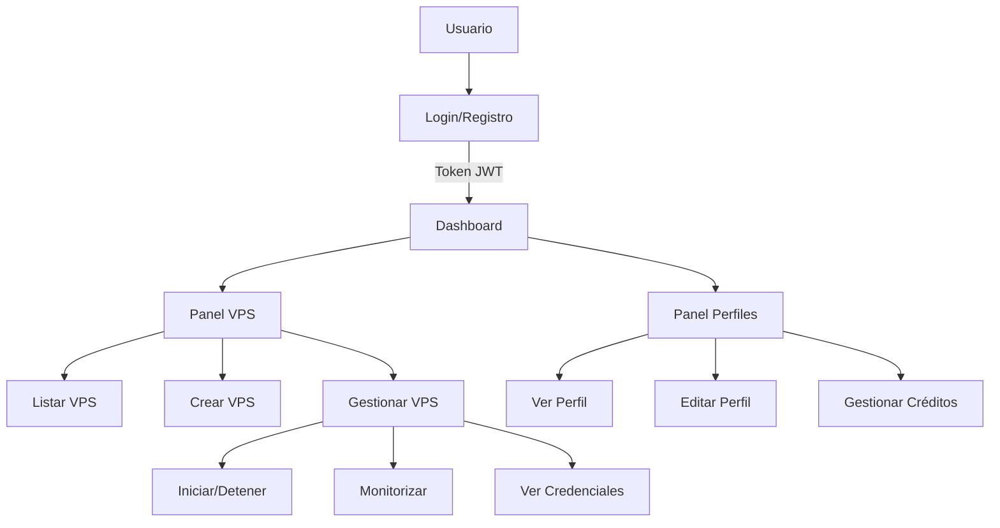

# Diagramas de Flujo del Sistema

## Frontend (React + TypeScript)


## Backend (Node.js + Express)
```mermaid
graph TD
    A[Cliente] --> B[Middleware Auth]
    B --> |Token Inválido| C[Error 401]
    B --> |Token Válido| D[Rutas API]
    
    D --> E[/auth]
    D --> F[/vps]
    D --> G[/clients]
    D --> H[/plans]
    
    E --> I[login]
    E --> J[register]
    
    F --> K[CRUD VPS]
    F --> L[Acciones VPS]
    
    G --> M[Gestión Clientes]
    G --> N[Gestión Créditos]
    
    H --> O[Listar Planes]
    
    K --> P[API Proxmox]
    L --> P
```

## API Proxmox (Python + FastAPI)
```mermaid
graph TD
    A[Backend] --> B[FastAPI Endpoints]
    B --> C[/vps]
    C --> D[GET /status]
    C --> E[POST /create]
    C --> F[POST /start]
    C --> G[POST /stop]
    C --> H[POST /restart]
    C --> I[GET /ip]
    E --> J[Clonar Template]
    J --> K[Configurar Cloud-init]
    K --> L[Asignar Recursos]
    D --> M[Proxmox API]
    F --> M
    G --> M
    H --> M
    I --> M
```